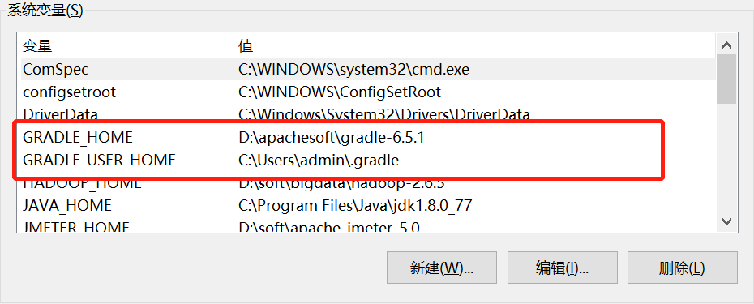
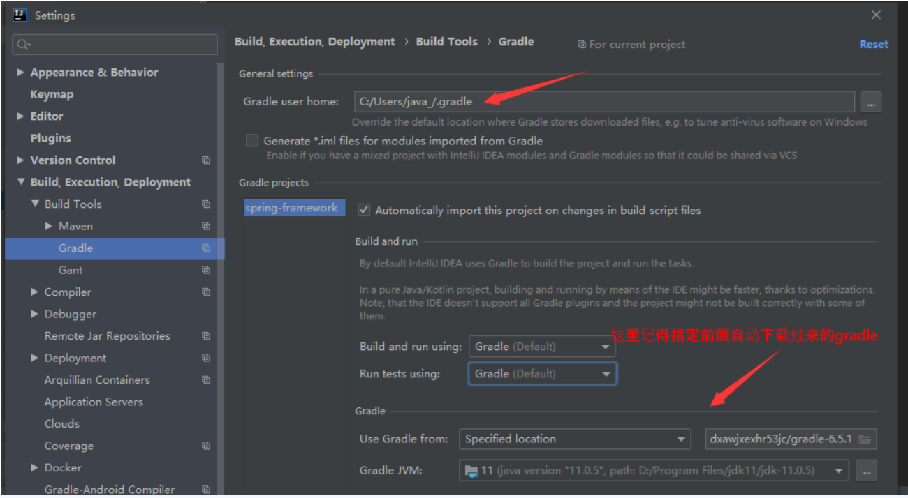

### 搭建spring-framework-5.1框架环境

#### 1 . 配置Gradle6.5.1环境

- 下载Gradle   [链接](https://gradle.org/next-steps/?version=6.5.1&format=bin)

- 配置Windows环境变量

  GRADLE_HOME：给windows系统用的环境变量

  GRADLE_HOME_USER: 给windows系统软件用的环境变量

  

- 测试：gradle -v、gradle build

  如果以前有./gradle文件，先删除了；

#### 2. 下载源码

- git clone https://github.com/spring-projects/spring-framework.git

- 设置gradle-wrapper.properties

  ```groovy
  distributionBase=GRADLE_USER_HOME
  distributionPath=wrapper/dists
  distributionUrl=file\:///D\:/apachesoft/gradle-6.5.1-bin.zip
  zipStoreBase=GRADLE_USER_HOME
  zipStorePath=wrapper/dists
  ```

- 设置build.gradle

  ```groovy
  repositories {
      maven {url 'https://maven.aliyun.com/repository/public'}
      mavenCentral()
      maven { url "https://repo.spring.io/libs-spring-framework-build" }
      maven { url "https://repo.spring.io/milestone" } // Reactor
  }
  ```

- 运行gradlew.bat，添加依赖

- 预编译：gradlew :spring-oxm:compileTestJava

#### 3. 导入Idea2019.3.5

- 在导入前设置好Gradle



- 选择根目录当中的build.gradle文件导入
- Run tests using要选IntelliJ IDEA, 否则无法Debug

